# High-Speed Protocol Stack  
## DPDK TAP Driver Performance Analysis

---

## 1. DPDK Installation and Build Configuration

First, DPDK is downloaded and installed. Then, the build environment is configured using **Meson** with function instrumentation enabled.


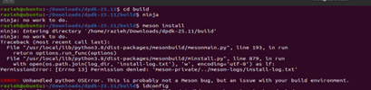

```bash
meson setup build \
  -Dexamples=all \
  -Dlibdir=lib \
  -Denable_trace_fp=true \
  -Dc_args="-finstrument-functions"
```
Dc_args="-finstrument-functions" flag guarantees that function entry and exit points are marked during compilation; otherwise, **LTTng traces will be empty**.
---

## 2. Huge Pages Configuration

Huge pages are configured to provide large contiguous memory regions required for high-speed packet processing in DPDK.
```bash
echo 1024 > /sys/kernel/mm/hugepages/hugepages-2048kB/nr_hugepages
mkdir /mnt/huge
mount -t hugetlbfs pagesize=1GB /mnt/huge
```
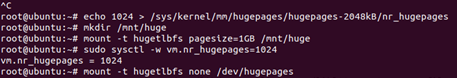

---

## 3. Kernel Version Check and TAP Interface Setup

The kernel version corresponding to `liblttng-ust-cyg-profile.so` is verified.  
```bash
sudo LD_PRELOAD=/usr/lib/x86_64-linux-gnu/liblttng-ust-cyg-profile.so.1 ./app/dpdk-testpmd -l 0-1 -n 2   --vdev=net_tap0,iface=tap0   --vdev=net_tap1,iface=tap1   --   -i
```
Two **TAP interfaces** are created and pinned to two CPUs. Initially, the port status shows no traffic.

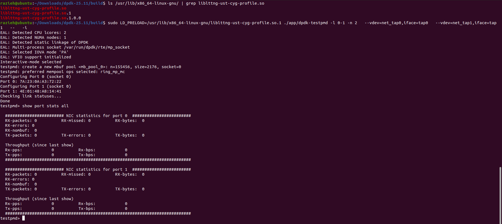

---

## 4. RX/TX Queue Configuration

Ports are stopped, new **RX and TX queues** are added, and the ports are restarted.

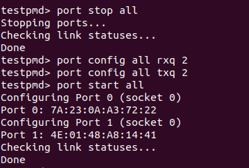

---

## 5. Forwarding Rules Configuration

The command below is used to verify the forwarding configuration:
show config fwd
```bash
flow create 0 ingress pattern eth / ipv4 / udp / end actions queue index 0 / end
```
A flow rule is created so that packets matching **Ethernet, IPv4, and UDP** headers are forwarded to **Queue 0**.

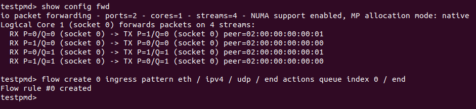

---

## 6. Traffic Generation Using Tcpreplay

`tcpreplay` is installed and configured to simulate network traffic load.

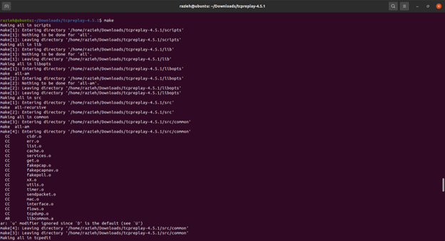

---

## 7. Packet Capture with Wireshark

Traffic is captured on the TAP interface using **Wireshark** and saved for later replay.

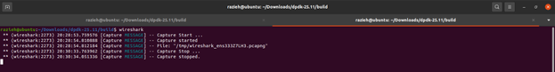

---

## 8. Traffic Replay

The captured traffic is replayed, and the generated packet flow is observed on the interfaces.

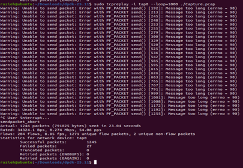
```bash
tcpreplay -i tap0 --loop=1000 ./Capture.pcap 
```
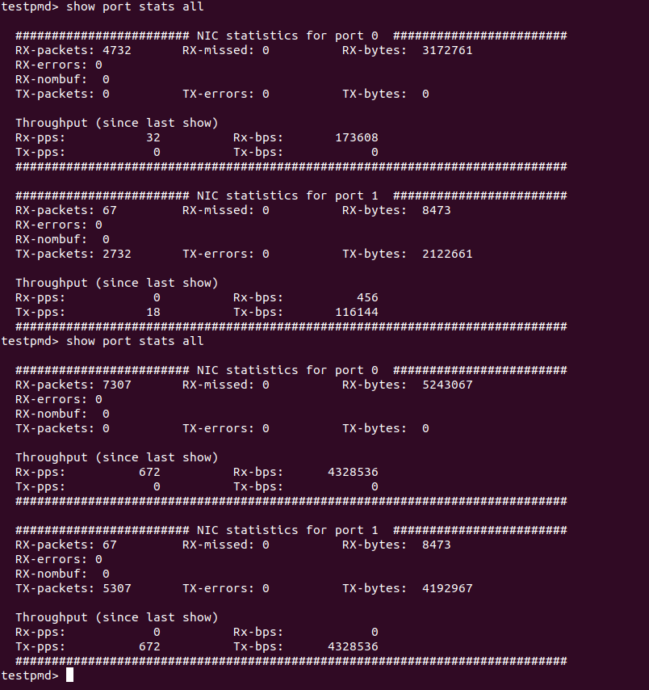

---

## 9. LTTng Tracing Setup

An **LTTng tracing script** is written and executed. The results are analyzed using **Trace Compass**.
```bash
#!/bin/bash
lttng create libpcap
lttng enable-channel --userspace --num-subbuf=4 --subbuf-size=40M channel0
#lttng enable-channel --userspace channel0
lttng enable-event --channel channel0 --userspace --all
lttng add-context --channel channel0 --userspace --type=vpid --type=vtid --type=procname
lttng start
sleep 2
lttng stop
lttng destroy
```
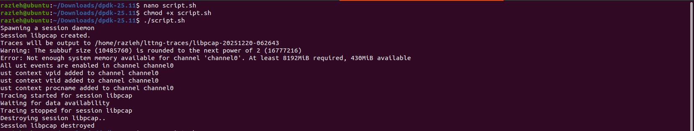

---

## 10. CPU Consumption Analysis

A **2-second LTTng recording** (approximately 1 million events) shows that most of the additional CPU overhead observed after applying the software flow rule is consumed by the **TAP PMD RX hot path**.

As shown in the pie charts:
- ~50% of events correspond to `func_entry`
- ~50% correspond to `func_exit`

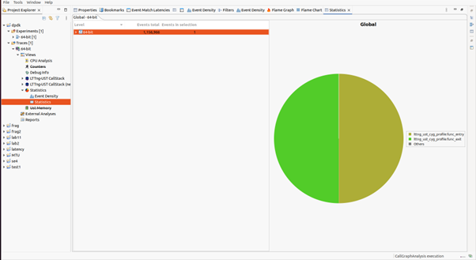


---

## 11. Time Chart Analysis – Bimodal Oscillation

The **Time Chart** reveals severe **bimodal oscillatory behavior**, where execution time periodically spikes.

This square-pattern behavior is a classical indicator of **cache depletion and refill cycles**, confirming that the current **Mempool configuration cannot sustain the incoming traffic rate**.

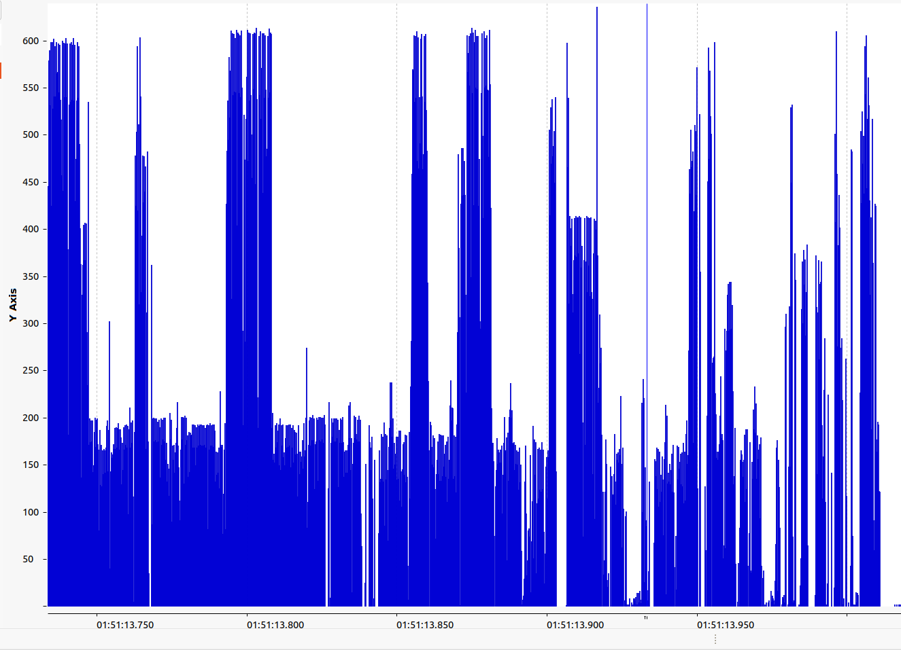


---

## 12. Execution Pattern Overview
**Observed execution flow:**
Receive → Process → Transmit → Free Memory.

This represents the main packet-processing pipeline in DPDK.
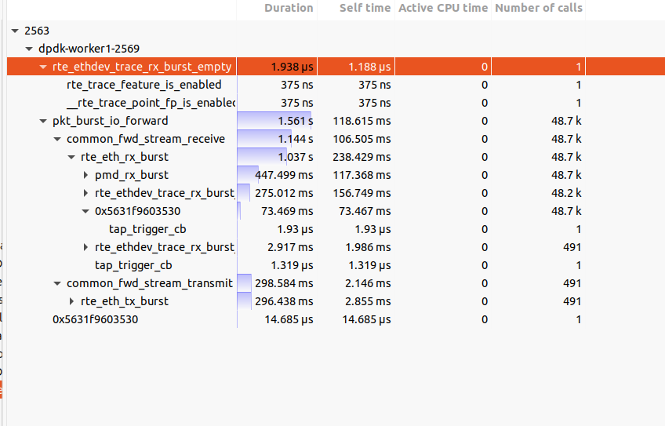

---
## 13. Main Loop Analysis (`pkt_burst_io_forward`)
- **Total Duration:** ~1.5 seconds  
- **Number of Calls:** 48,728  
- **Average Duration:** 32 µs  
- **Maximum Duration:** **28.5 ms**
Critical Insight: The difference between the average and maximum execution time (~1000×) indicates severe intermittent stalls in the processing loop.
---
## 14. TX Path Analysis
- **Duration:** ~300 ms  
- **Label:** `common_fwd_stream_transmit`
**Functions involved:**
- `rte_eth_tx_burst`
- `pmd_tx_burst`
- `rte_pktmbuf_free`
**Observation:**  
The TX path is relatively efficient and does not represent a major performance concern.
---
## 15. RX Path Analysis – Main Bottleneck

- **RX Duration:** **~1.1 seconds**
- **CPU Utilization:** **>73%**
- **Maximum System Latency:** 28.5 ms
- **Maximum RX Latency:** **22.3 ms**

**Functions involved:**
- `rte_eth_rx_burst` — consumes nearly **⅔ of total CPU time**
- `pmd_rx_burst`
- `rte_pktmbuf_alloc`

RX processing is approximately **4× more expensive than TX**.

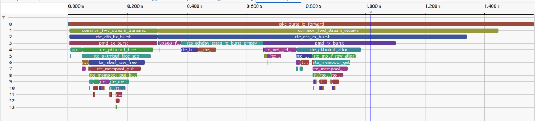

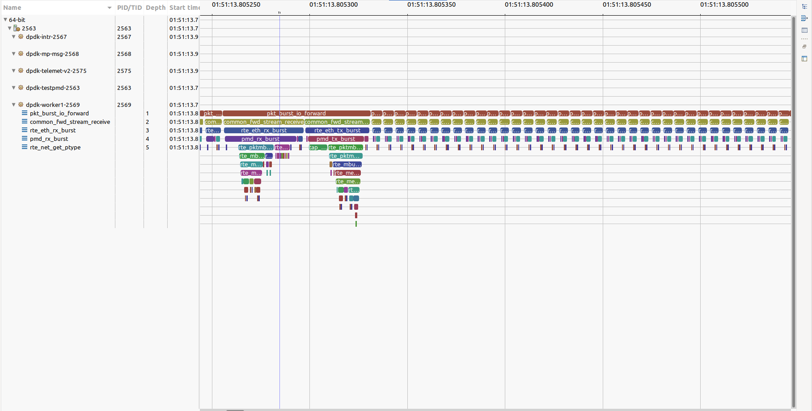

---
### 📉 Detailed Call Stack: The Cost of Memory Allocation

This hierarchical view of the call stack provides irrefutable evidence of the memory bottleneck within the RX path:

*   **Driver Execution:** The `pmd_rx_burst` function (TAP driver receive) took a total of **447.499 ms**.
*   **The Bottleneck:** Inside this function, `rte_pktmbuf_alloc` consumed **216.735 ms**.
*   **Impact:** Memory allocation alone accounts for **~48.4%** of the total driver execution time.

**Technical Insight:**
Ideally, `rte_pktmbuf_alloc` should be near-instantaneous by fetching from the per-core cache. The fact that it consumes half the execution time confirms that the **Mempool Cache is thrashing or empty**, forcing the system to fall back to the slower underlying ring mechanism to fetch memory blocks.

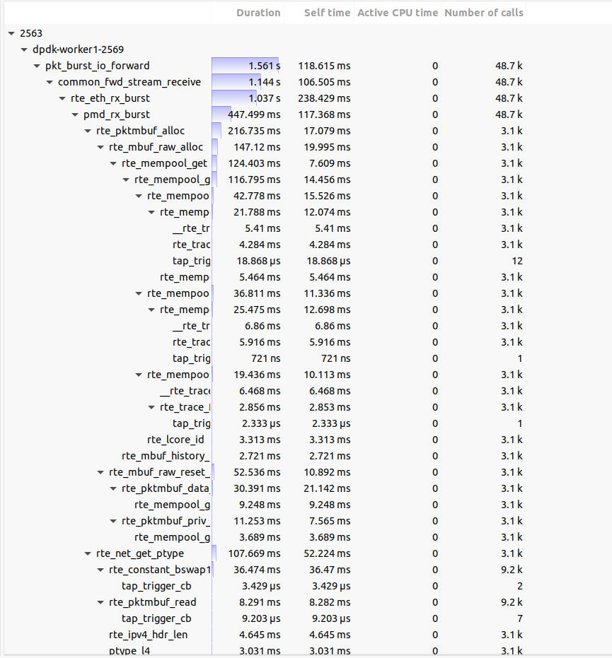

---

## 16. Layered Bottleneck Analysis

- **General Flow:** RX dominates with over **73%** of total CPU time  
- **Driver Level:** `pmd_rx_burst` causes critical **22 ms delays**  
- **Inefficiency:** **99% empty RX polls**, indicating inefficient kernel–user signaling

The system bottleneck is the **inefficient RX path of the TAP driver**, which relies heavily on kernel–user context switches.

---

## 17. Root Cause Analysis

Frequent **kernel ↔ user context switches**, combined with intensive memory allocation (`rte_pktmbuf_alloc`), impose significant overhead and prevent DPDK from reaching its expected performance.

---

## 18. Proposed Solutions

1. Analyze sender-side behavior  
2. Increase RX burst size  
3. Replace the TAP driver with a more efficient alternative  
4. Enable deeper kernel-level tracing  

---
## 19. Summary of Trace Analysis Findings

The following table summarizes the key bottlenecks identified using LTTng and Trace Compass:

| Metric | Dominant Functions / Observations | Evidence within TraceCompass |
| :--- | :--- | :--- |
| **Root Cause Function** | `pmd_rx_burst` → **`rte_pktmbuf_alloc`** | **Flame Graph** (Deepest level analysis) & Function Duration Statistics |
| **Call Count Analysis** | `rte_ethdev_trace_rx_burst_empty` (Called **48,236** times out of 48,728) → **99% Empty Polls** | **Statistics View** (Top-level aggregation) |
| **Time Consumption** | `rte_pktmbuf_alloc` consumes **~216 ms** (out of 447 ms total in PMD) → **~50% Overhead** | **Flame Graph Tooltip** (Self-time vs Total-time) |
| **Latency Spikes (Jitter)** | Max latency in `pmd_rx_burst` = **22.3 ms**.<br>Max latency in `alloc` = **9.5 ms**. | **Function Duration Distribution** & Time Chart |
| **Performance Pattern** | Square-wave pattern bimodal distribution). Latency jumps between **~80 μs** (cache hit) and **~220 μs** (cache miss). | **Time Chart View** (Visualizing Cache Thrashing) |
---
## 20. Test Configuration: The Critical Role of Flow Isolation
To ensure accurate profiling and repeatable results, we applied a specific **rte_flow** rule to steer traffic:
**Why was this rule essential?**
Without this explicit instruction, the analysis would have been compromised by the default behavior of the driver/kernel.

| Impact Area | With Flow Rule (Our Setup) | Without Flow Rule (Default Behavior) |
| :--- | :--- | :--- |
| **Traffic Steering** | **Deterministic:** 100% of IPv4/UDP traffic is forced into **Queue 0**. | **Random/Hashed:** Traffic is distributed across multiple queues (RSS), diluting the load. |
| **Bottleneck Detection** | **High Stress:** By concentrating load on a single core, we successfully triggered and visualized the **Mempool Cache Thrashing** and `alloc` latency. | **Masked Issues:** The load would spread across cores, likely hiding the memory allocation bottleneck and making the 22ms latency spikes disappear or appear random. |
| **Signal-to-Noise** | **Clean Trace:** Only relevant UDP packets are processed. | **Noisy Trace:** ARP, IPv6, and control packets would pollute the trace data, affecting the accuracy of function duration statistics. |

**Conclusion:** This rule allowed us to isolate the performance of a single RX queue under maximum load, proving that the **Mempool Cache size** was the limiting factor when a single core is saturated.
---
## 21. Performance Analysis & Optimization Proposal: DPDK TAP Driver

### Problem Statement
During high-load performance profiling of the DPDK application using the **TAP PMD** driver, significant latency spikes and throughput degradation were observed.

Using **LTTng-UST** and **Trace Compass**, we identified a major bottleneck in the RX path (`pmd_rx_burst`).

### Profiling Evidence
Trace analysis revealed that memory allocation is a dominant factor in the receive cycle:
*   **Total RX Time:** The `pmd_rx_burst` function execution time was measured at **~447 ms** for the captured duration.
*   **Allocation Overhead:** Inside this function, `rte_pktmbuf_alloc` consumed **~216 ms**.
*   **Impact:** Approximately **48.4%** of the driver's execution time is spent solely on allocating `mbufs`, indicating inefficient memory management and potential cache thrashing.
---
### Source Code Analysis
We examined the source code for the TAP driver (specifically `drivers/net/tap/rte_eth_tap.c`) to understand the root cause.
**Current Implementation (Scalar Allocation):**
The current implementation iterates through the requested number of packets and allocates memory **one by one** inside the loop.
```c
/* Pseudocode representation of current drivers/net/tap/rte_eth_tap.c */
static uint16_t
pmd_rx_burst(void *queue, struct rte_mbuf **bufs, uint16_t nb_pkts)
{
int i;
for (i = 0; i < nb_pkts; i++) {
// 🔴 CRITICAL BOTTLENECK:
// Allocating one mbuf at a time causes high function call overhead
// and poor cache locality.
struct rte_mbuf *mbuf = rte_pktmbuf_alloc(rxq->mp);

if (unlikely(!mbuf))
break;

// System call to read packet data
int len = readv(rxq->fd, iov, iovcnt);

if (len <= 0) {
rte_pktmbuf_free(mbuf);
break;
}

bufs[i] = mbuf;
}
return i;
}
```
**Why this is slow:**
1.  **Function Call Overhead:** Calling `rte_pktmbuf_alloc` $N$ times for a burst of $N$ packets is inefficient.
2.  **Cache Pressure:** It prevents the CPU from optimizing memory prefetching, leading to the "thrashing" pattern observed in the Trace Compass time charts.
---
### Proposed Optimization: Bulk Allocation
To address the bottleneck, we propose modifying the RX function to use **Bulk Allocation**. DPDK provides `rte_pktmbuf_alloc_bulk`, which is highly optimized to fetch multiple pointers from the mempool cache in a single operation.

### Optimized Implementation Logic

```c
/* Proposed Optimization */

static uint16_t
pmd_rx_burst_optimized(void *queue, struct rte_mbuf **bufs, uint16_t nb_pkts)
{
// 🟢 OPTIMIZATION:
// Allocate all required mbufs at once (Bulk Allocation)
int ret = rte_pktmbuf_alloc_bulk(rxq->mp, bufs, nb_pkts);

if (unlikely(ret != 0)) {
// Return 0 if we cannot allocate the full burst
return 0;
}

int i;
for (i = 0; i < nb_pkts; i++) {
struct rte_mbuf *mbuf = bufs[i];

// System call to read packet data
int len = readv(rxq->fd, iov, iovcnt);

if (len <= 0) {
// ⚠️ CLEANUP:
// If read fails, we must free the remaining pre-allocated mbufs
// that were not used.
rte_pktmbuf_free_bulk(&bufs[i], nb_pkts - i);
return i;
}

// ... metadata processing ...
}

return nb_pkts;
}
```
### Expected Benefits
1.  **Reduced Latency:** Eliminates the repeated overhead of function calls inside the hot path loop.
2.  **Improved Cache Usage:** Retrieving pointers in bulk increases the probability of CPU cache hits.
3.  **Throughput Gain:** By reducing the time spent in `rte_pktmbuf_alloc` (currently 48%), more CPU cycles are available for actual packet processing and I/O.
---

## 22. Final Results and Conclusion
Because the TAP driver relies heavily on system calls and CPU-based memory copying, significant processing overhead occurs in the kernel (Context Switching), acting as a "black box" to user-space tools.

However, our Trace Compass analysis successfully isolated the root causes:

1.  **Primary Bottleneck:** `pmd_rx_burst` dominates the execution time.
2.  **Memory Overhead:** `rte_pktmbuf_alloc` consumes nearly **50%** of the driver's execution time.
3.  **Root Cause:** The bimodal execution pattern confirms **Mempool Cache Thrashing**, caused by a suboptimal cache size relative to the burst size.

**✅ Recommendation:**
Increasing the **Mempool Cache Size** will directly mitigate the allocation latency. For environments requiring higher throughput beyond TAP's architectural limits, migrating to the **Virtio-User** driver is recommended.

